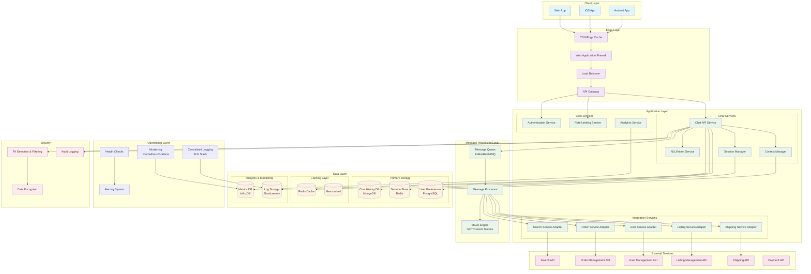

```mermaid
graph TB
    %% Client Layer
    subgraph "Client Layer"
        WEB[Web App]
        IOS[iOS App]
        AND[Android App]
    end

    %% API Gateway & Load Balancing
    subgraph "Edge Layer"
        CDN[CDN/Edge Cache]
        LB[Load Balancer]
        WAF[Web Application Firewall]
        GATEWAY[API Gateway]
    end

    %% Core Services
    subgraph "Application Layer"
        subgraph "Chat Services"
            CHAT_API[Chat API Service]
            NLU[NLU/Intent Service]
            CONTEXT[Context Manager]
            SESSION[Session Manager]
        end
        
        subgraph "Integration Services"
            SEARCH_SVC[Search Service Adapter]
            ORDER_SVC[Order Service Adapter]
            USER_SVC[User Service Adapter]
            LISTING_SVC[Listing Service Adapter]
            SHIPPING_SVC[Shipping Service Adapter]
        end
        
        subgraph "Core Services"
            AUTH[Authentication Service]
            RATE_LIMIT[Rate Limiting Service]
            ANALYTICS[Analytics Service]
        end
    end

    %% Message Processing
    subgraph "Message Processing Layer"
        QUEUE[Message Queue<br/>Kafka/RabbitMQ]
        PROCESSOR[Message Processor]
        ML_ENGINE[ML/AI Engine<br/>GPT/Custom Models]
    end

    %% External Services (Existing)
    subgraph "External Services"
        SEARCH_API[Search API]
        ORDER_API[Order Management API]
        USER_API[User Management API]
        LISTING_API[Listing Management API]
        SHIPPING_API[Shipping API]
        PAYMENT_API[Payment API]
    end

    %% Data Layer
    subgraph "Data Layer"
        subgraph "Primary Storage"
            CHAT_DB[(Chat History DB<br/>MongoDB)]
            SESSION_DB[(Session Store<br/>Redis)]
            USER_PREF_DB[(User Preferences<br/>PostgreSQL)]
        end
        
        subgraph "Caching Layer"
            REDIS_CACHE[(Redis Cache)]
            MEMCACHED[(Memcached)]
        end
        
        subgraph "Analytics & Monitoring"
            METRICS_DB[(Metrics DB<br/>InfluxDB)]
            LOG_STORE[(Log Storage<br/>Elasticsearch)]
        end
    end

    %% Monitoring & Operations
    subgraph "Operational Layer"
        MONITORING[Monitoring<br/>Prometheus/Grafana]
        LOGGING[Centralized Logging<br/>ELK Stack]
        ALERTING[Alerting System]
        HEALTH_CHECK[Health Checks]
    end

    %% Security Layer
    subgraph "Security"
        ENCRYPTION[Data Encryption]
        PII_FILTER[PII Detection & Filtering]
        AUDIT[Audit Logging]
    end

    %% Data Flow Connections
    WEB --> CDN
    IOS --> CDN
    AND --> CDN
    
    CDN --> WAF
    WAF --> LB
    LB --> GATEWAY
    
    GATEWAY --> AUTH
    GATEWAY --> RATE_LIMIT
    GATEWAY --> CHAT_API
    
    CHAT_API --> NLU
    CHAT_API --> CONTEXT
    CHAT_API --> SESSION
    CHAT_API --> QUEUE
    
    QUEUE --> PROCESSOR
    PROCESSOR --> ML_ENGINE
    PROCESSOR --> SEARCH_SVC
    PROCESSOR --> ORDER_SVC
    PROCESSOR --> USER_SVC
    PROCESSOR --> LISTING_SVC
    PROCESSOR --> SHIPPING_SVC
    
    SEARCH_SVC --> SEARCH_API
    ORDER_SVC --> ORDER_API
    USER_SVC --> USER_API
    LISTING_SVC --> LISTING_API
    SHIPPING_SVC --> SHIPPING_API
    
    CHAT_API --> CHAT_DB
    SESSION --> SESSION_DB
    CONTEXT --> USER_PREF_DB
    CHAT_API --> REDIS_CACHE
    
    ANALYTICS --> METRICS_DB
    CHAT_API --> LOG_STORE
    
    CHAT_API --> PII_FILTER
    PII_FILTER --> ENCRYPTION
    CHAT_API --> AUDIT
    
    MONITORING --> METRICS_DB
    LOGGING --> LOG_STORE
    HEALTH_CHECK --> ALERTING

    %% Styling
    classDef client fill:#e1f5fe
    classDef edge fill:#f3e5f5
    classDef service fill:#e8f5e8
    classDef data fill:#fff3e0
    classDef external fill:#fce4ec
    classDef security fill:#ffebee
    
    class WEB,IOS,AND client
    class CDN,LB,WAF,GATEWAY edge
    class CHAT_API,NLU,CONTEXT,SESSION,SEARCH_SVC,ORDER_SVC,USER_SVC,LISTING_SVC,SHIPPING_SVC,AUTH,RATE_LIMIT,ANALYTICS,QUEUE,PROCESSOR,ML_ENGINE service
    class CHAT_DB,SESSION_DB,USER_PREF_DB,REDIS_CACHE,MEMCACHED,METRICS_DB,LOG_STORE data
    class SEARCH_API,ORDER_API,USER_API,LISTING_API,SHIPPING_API,PAYMENT_API external
    class ENCRYPTION,PII_FILTER,AUDIT security
```
