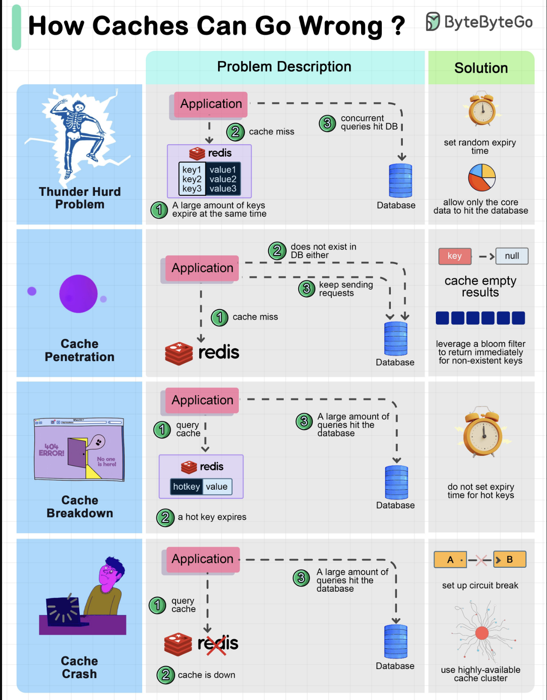

# Cache Problems and Solutions

## 1. Thunder Herd

**Problem:** When a large number of keys expire simultaneously, all subsequent queries for these keys bypass the cache and hit the database directly, leading to a surge in database load.

**Solutions:**

- **Stagger Expiry Times:** Avoid setting identical expiry times for a large group of keys. Introduce a random offset to their expiry times.
- **Prioritize Data:** Allow core business-critical data to hit the database if necessary, while non-critical data waits until the cache is repopulated.

## 2. Cache Penetration

**Problem:** A request is made for a key that does not exist in the cache, nor in the database. This leads to repeated, unnecessary database queries for non-existent data.

**Solutions:**

- **Cache Null Values:** Store a special "null" or "not found" value in the cache for non-existent keys. This prevents repeated database lookups for the same non-existent data.
- **Bloom Filter:** Use a Bloom filter to quickly check if a key *might* exist before querying the database. If the Bloom filter indicates the key definitely does not exist, the database query can be avoided.

## 3. Cache Breakdown

**Problem:** When a "hot" key (a key that is frequently accessed) expires, a large number of concurrent requests for that key will bypass the cache and hit the database, causing a sudden spike in database load.

**Solution:**

- **Do Not Expire Hot Keys:** For extremely hot keys that account for a significant percentage (e.g., 80%) of queries, consider not setting an expiry time or setting a very long one. Alternatively, implement a proactive refresh mechanism for these keys.

## 4. Cache Crash

**Problem:** The entire cache system becomes unavailable (crashes), leading to all incoming requests directly hitting the database, potentially overwhelming it.

**Solutions:**

- **Circuit Breaker:** Implement a circuit breaker pattern. When the cache is detected as down, the circuit breaker can prevent further requests from hitting the database directly, perhaps by returning a default value or an error, to protect the database.
- **Cache Cluster/High Availability:** Deploy the cache in a clustered or highly available configuration (e.g., multiple nodes, replication) to improve its resilience and minimize downtime.

