# Design Consistent Hashing

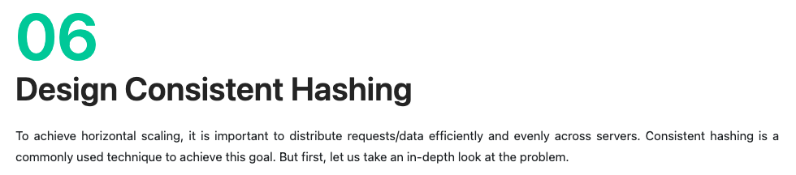
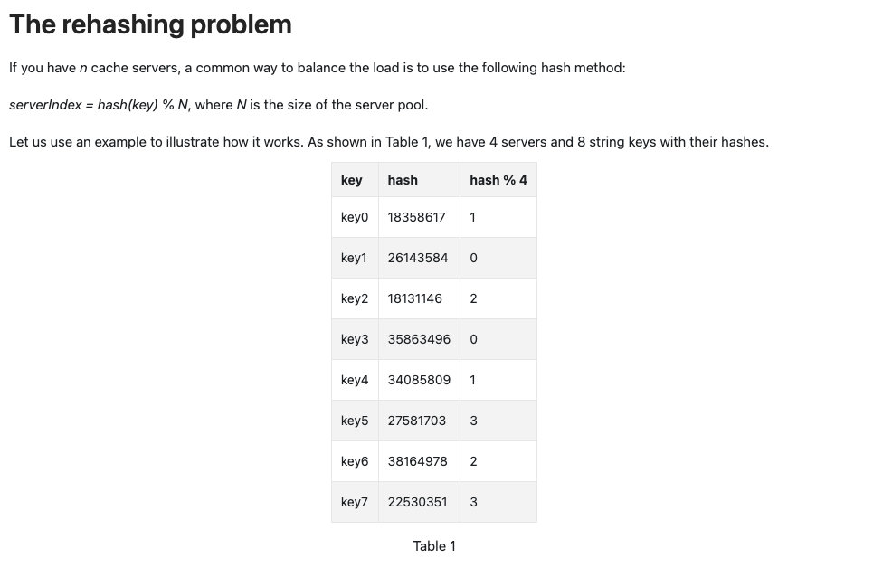

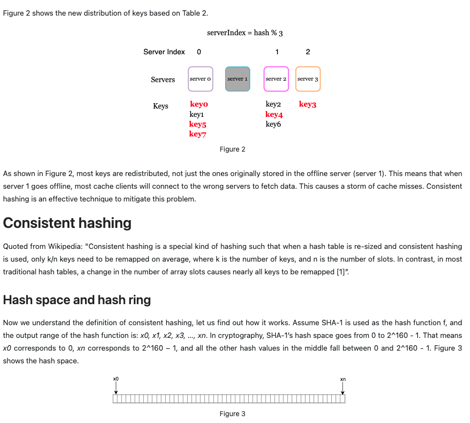
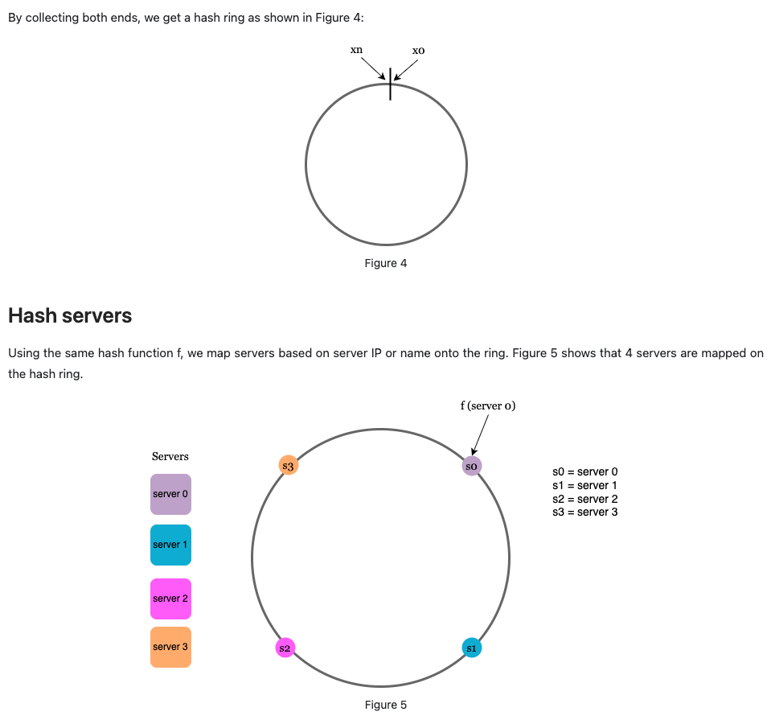
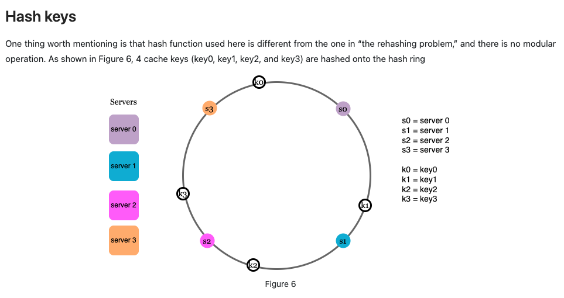
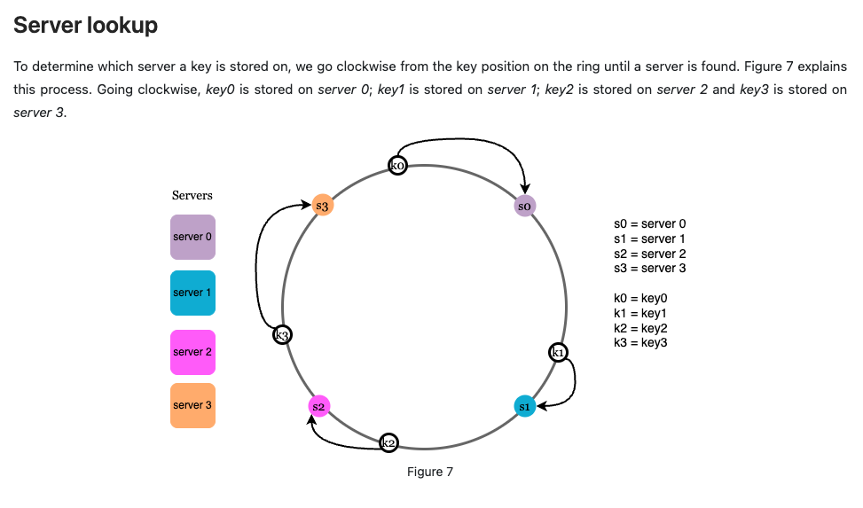
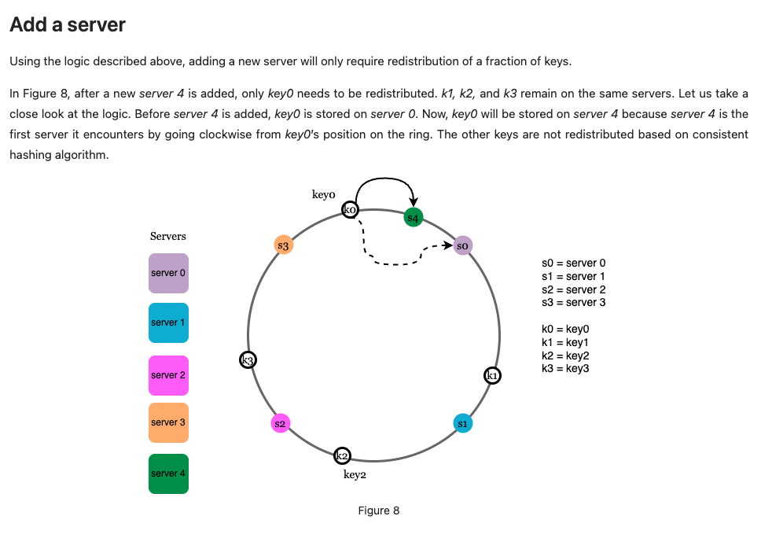
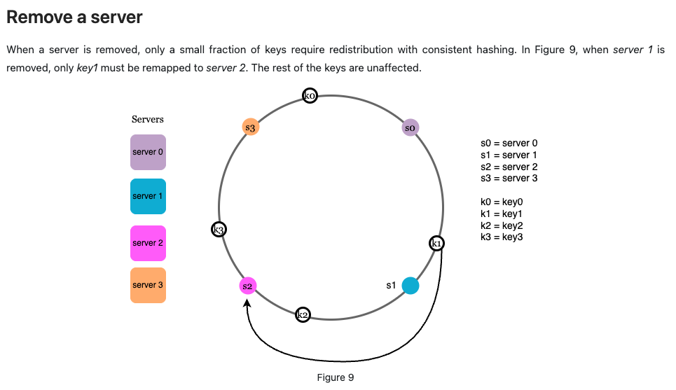
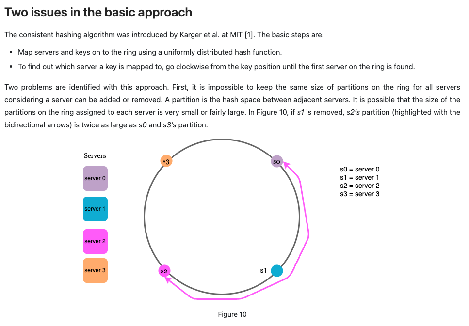
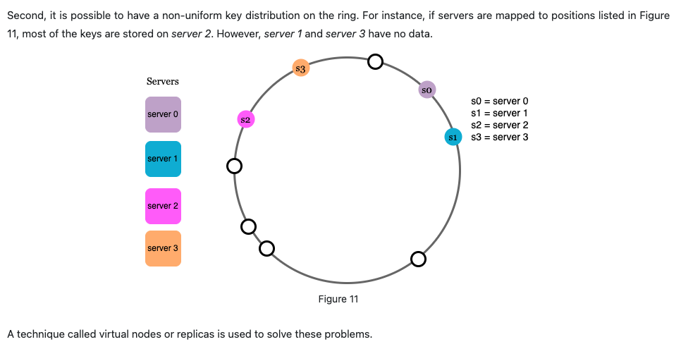
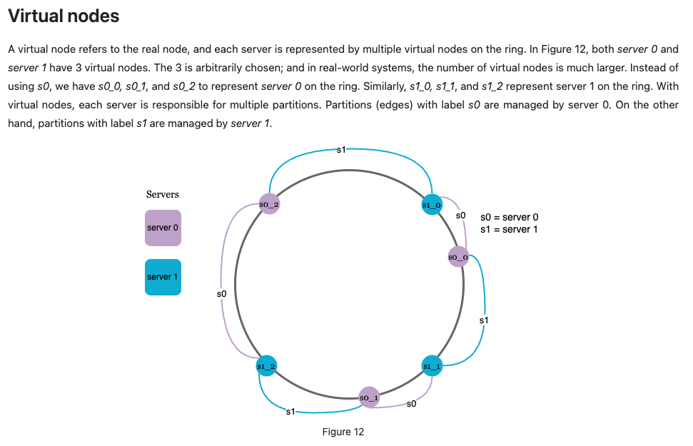
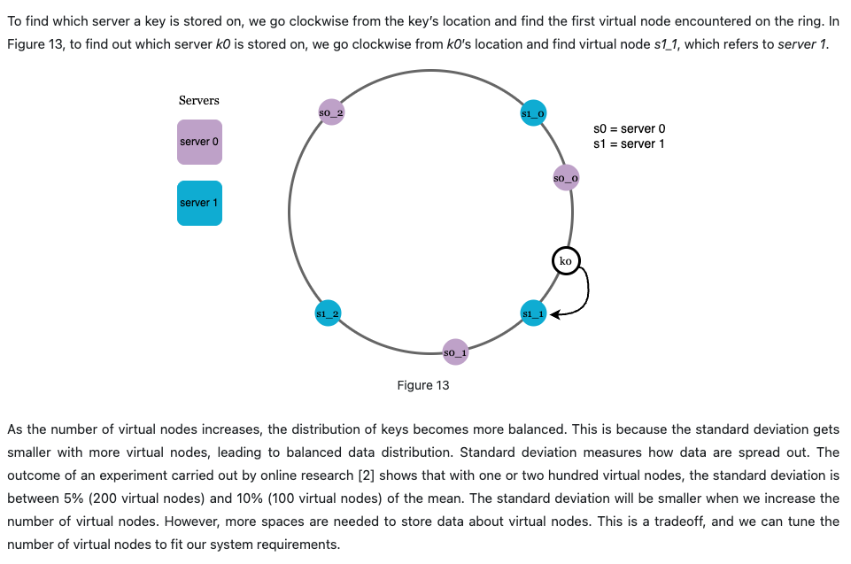

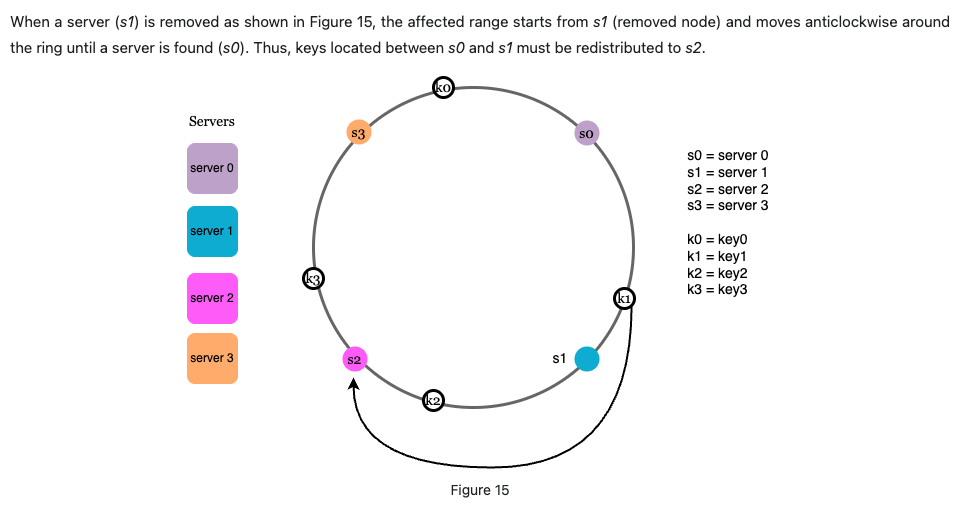
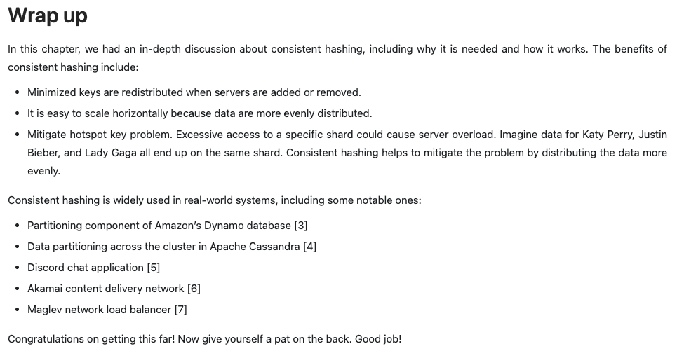

## Reference materials

[1] Consistent hashing:
<https://en.wikipedia.org/wiki/Consistent_hashing>

[2] Consistent Hashing:
<https://tom-e-white.com/2007/11/consistent-hashing.html>

[3] Dynamo: Amazon’s Highly Available Key-value Store:
<https://www.allthingsdistributed.com/files/amazon-dynamo-sosp2007.pdf>

[4] Cassandra - A Decentralized Structured Storage System:
<http://www.cs.cornell.edu/Projects/ladis2009/papers/Lakshman-ladis2009.PDF>

[5] How Discord Scaled Elixir to 5,000,000 Concurrent Users:
<https://discord.com/blog/how-discord-scaled-elixir-to-5-000-000-concurrent-users>

[6] CS168: The Modern Algorithmic Toolbox Lecture #1: Introduction and Consistent Hashing:
<http://theory.stanford.edu/~tim/s16/l/l1.pdf>

[7] Maglev: A Fast and Reliable Software Network Load Balancer:
<https://static.googleusercontent.com/media/research.google.com/en//pubs/archive/44824.pdf>
