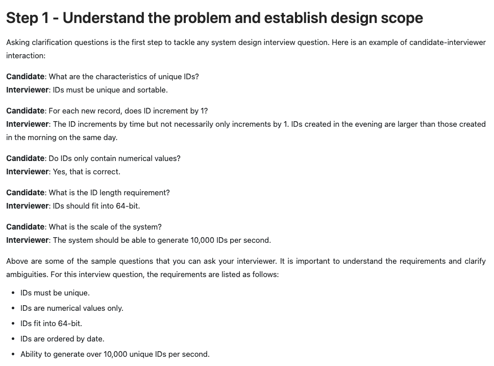
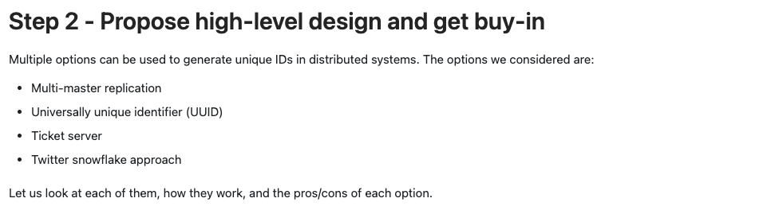
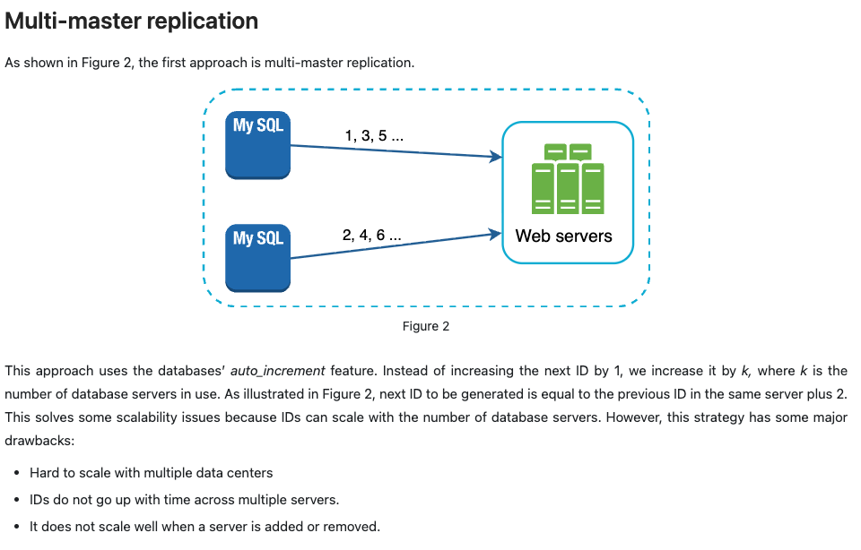
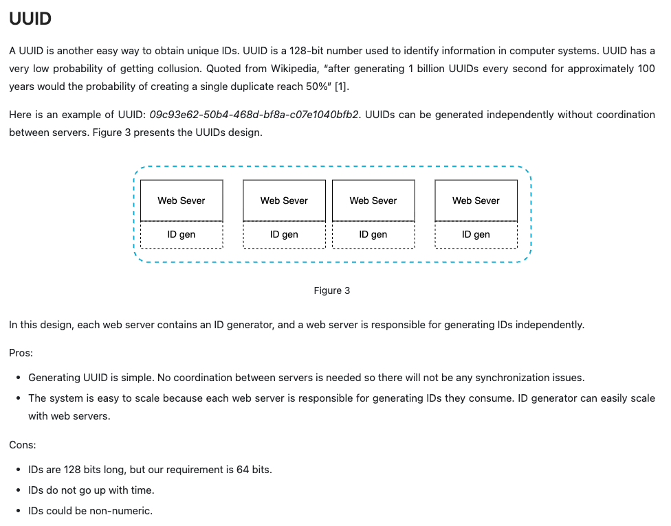
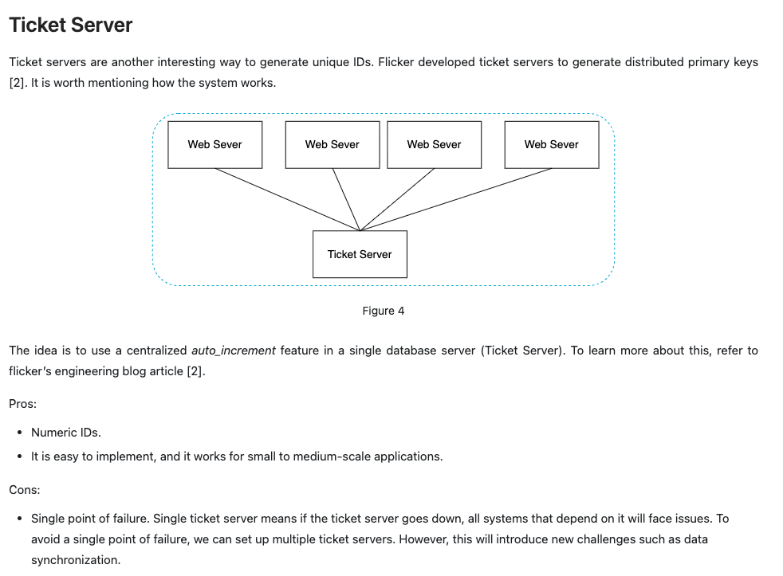
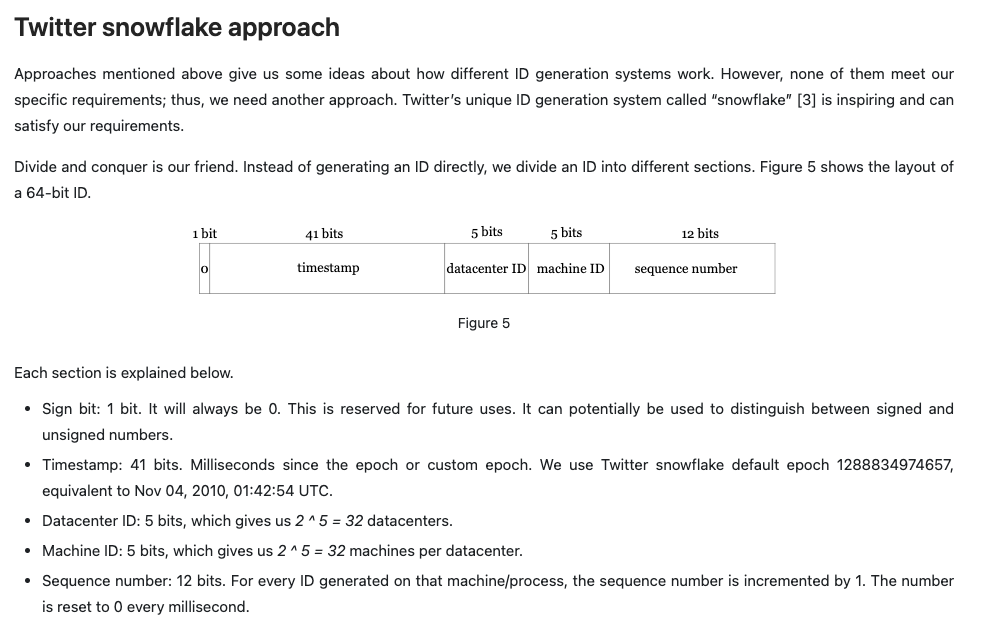
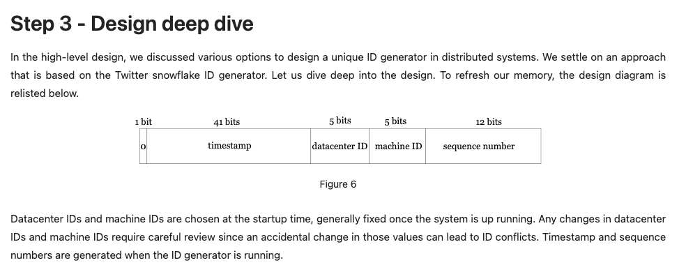
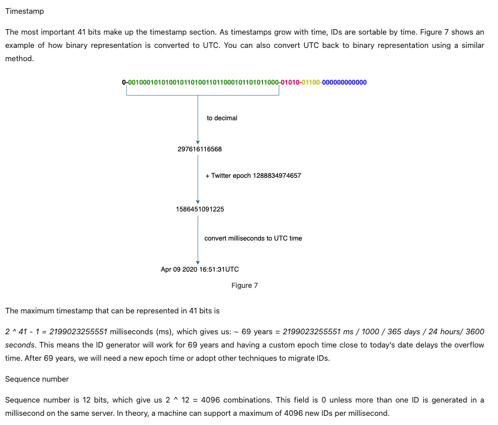
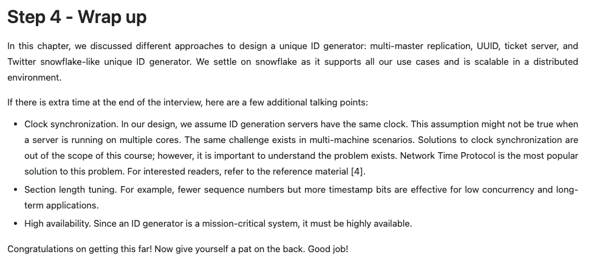

# Design A Unique ID Generator In Distributed Systems

## Reference materials

[1] Universally unique identifier:
<https://en.wikipedia.org/wiki/Universally_unique_identifier>

[2] Ticket Servers: Distributed Unique Primary Keys on the Cheap:
<https://code.flickr.net/2010/02/08/ticket-servers-distributed-unique-primary-keys-on-the-cheap/>

[3] Announcing Snowflake:
<https://blog.twitter.com/engineering/en_us/a/2010/announcing-snowflake.html>

[4] Network time protocol:
<https://en.wikipedia.org/wiki/Network_Time_Protocol>
