# Design A News Feed System

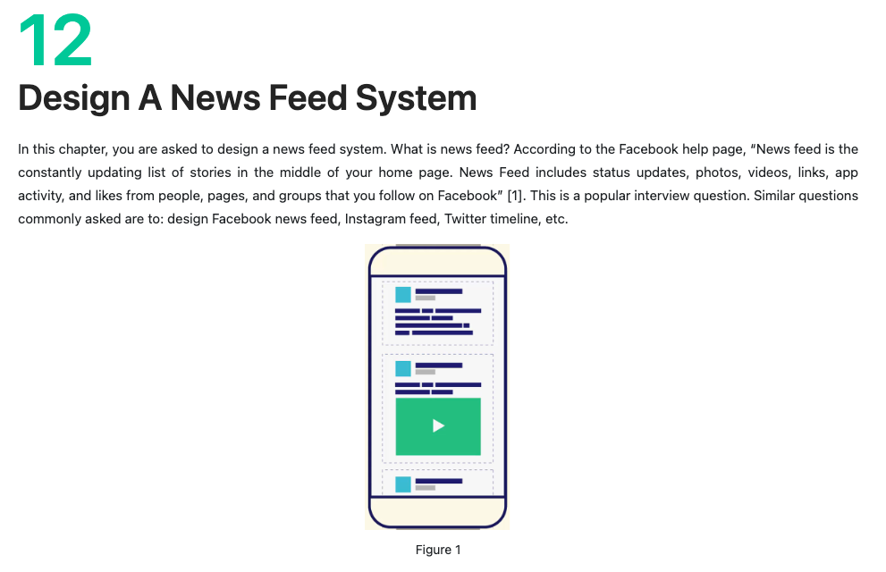
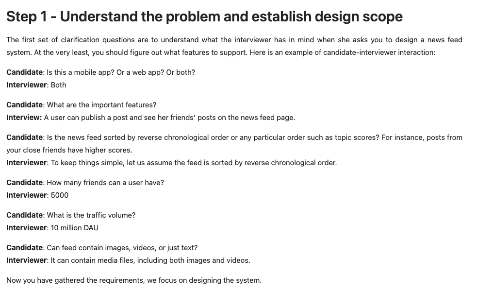
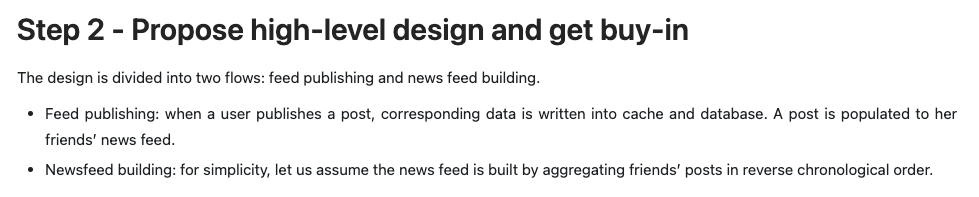
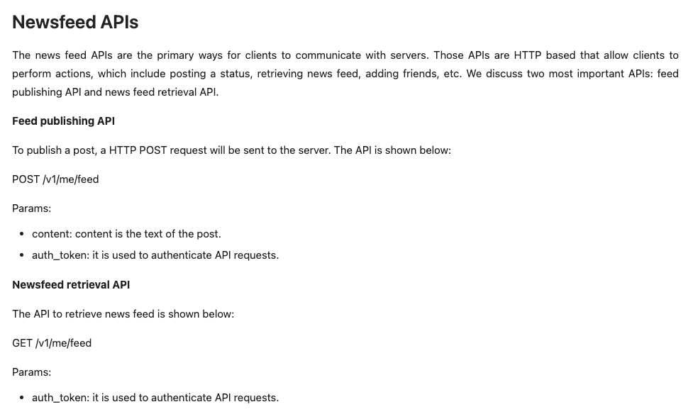
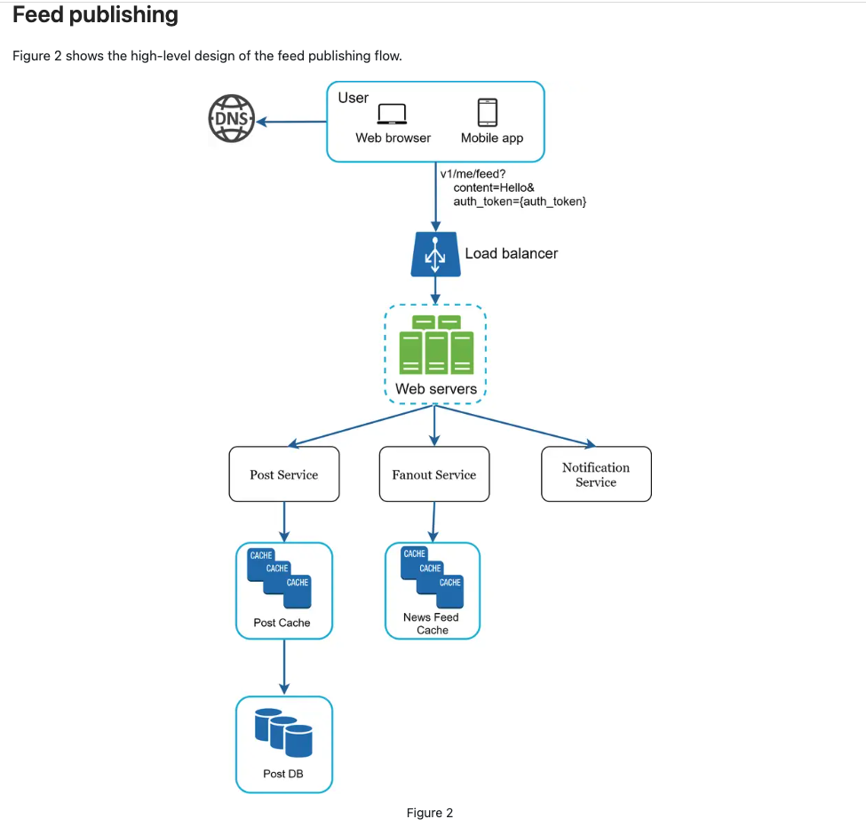
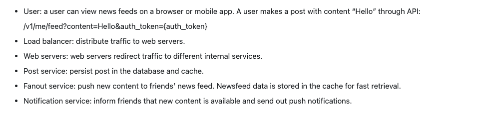
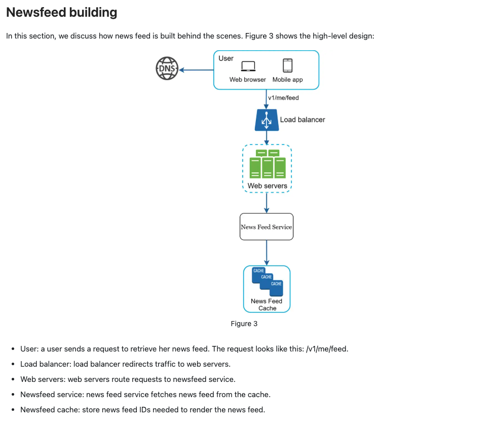
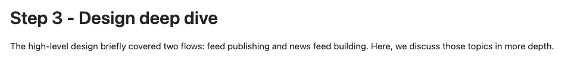
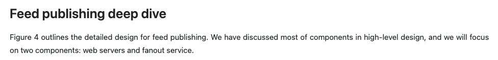
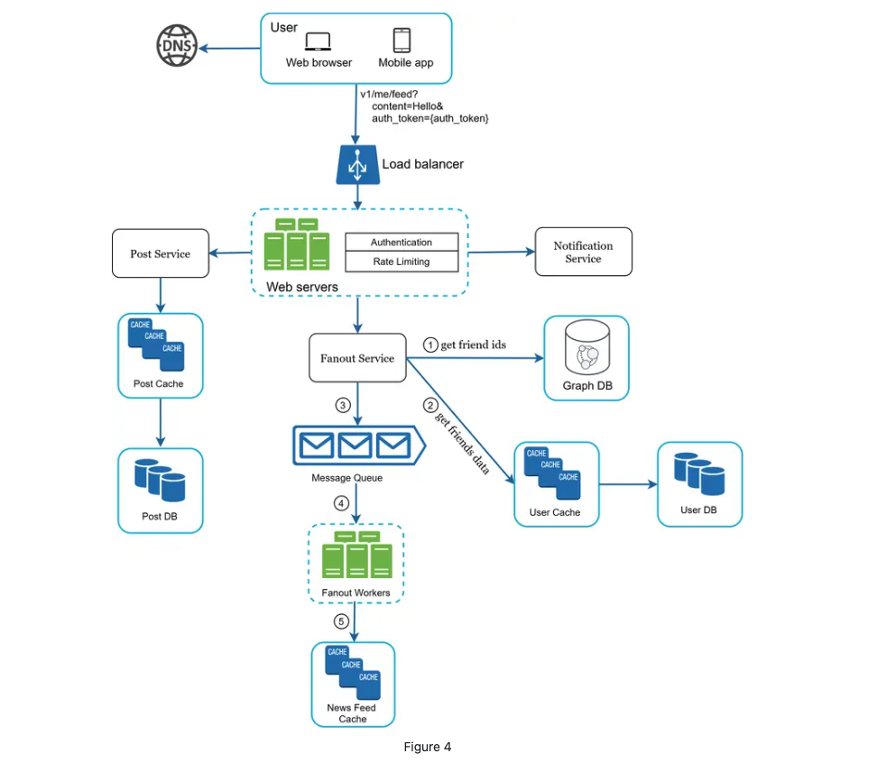
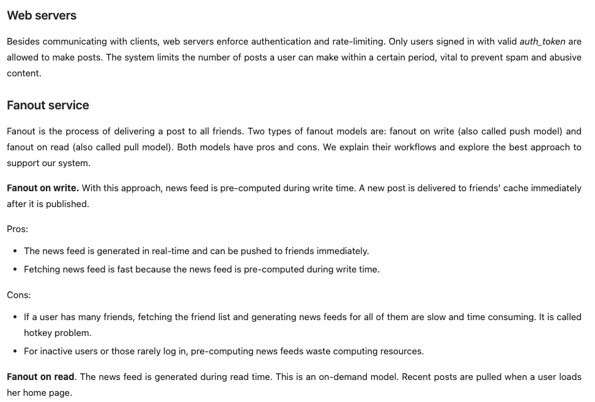
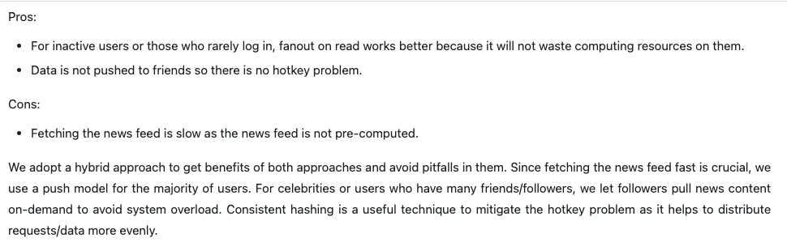
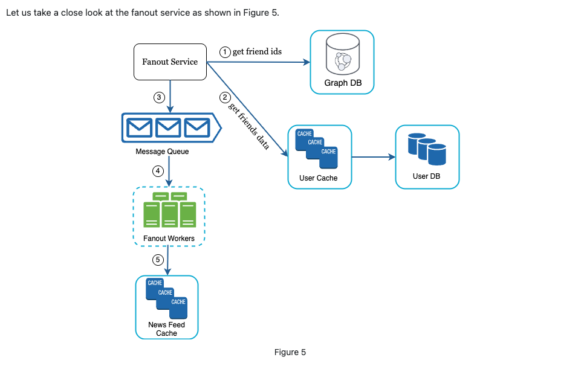
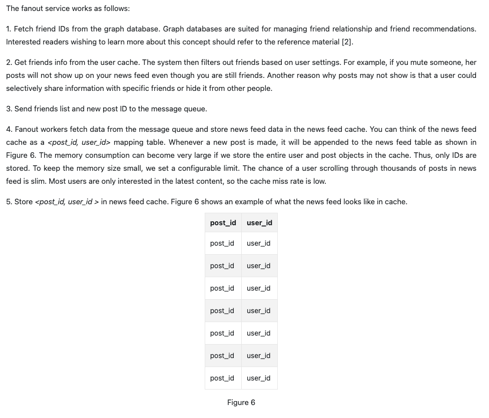
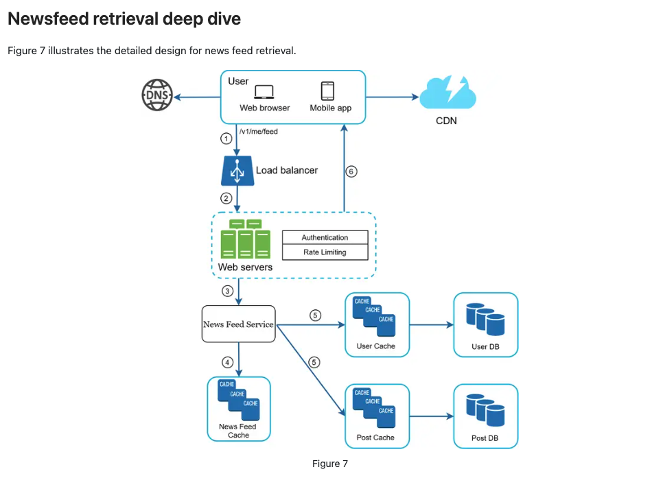
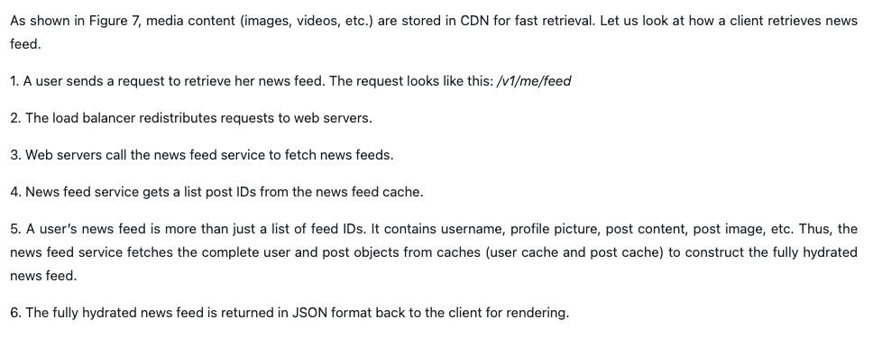
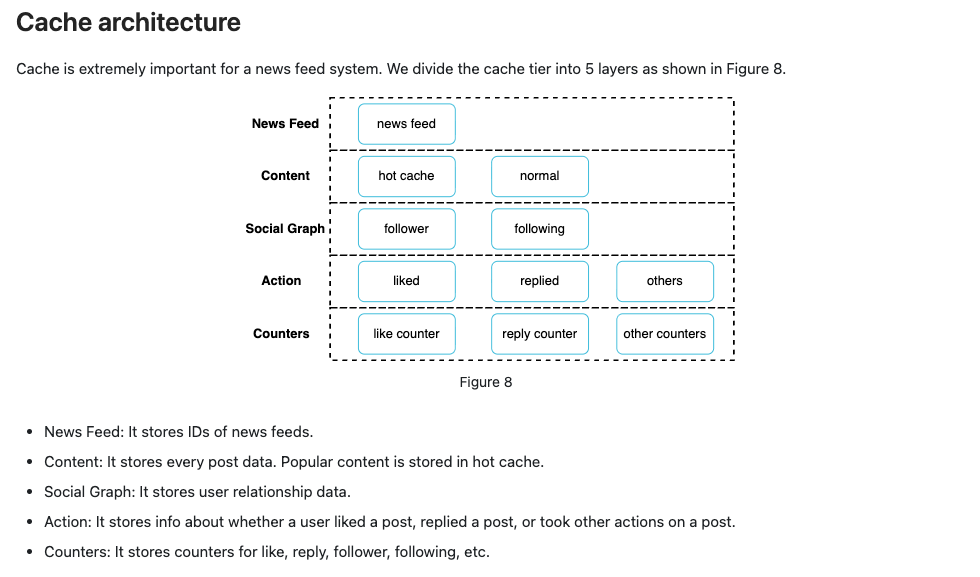
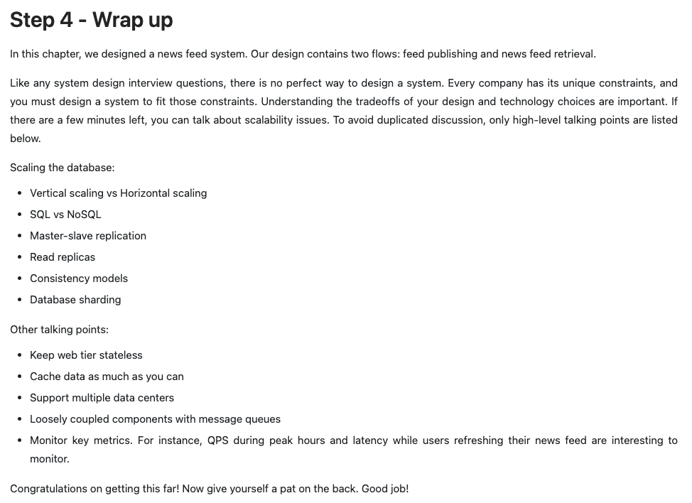

## Reference materials

[1] How News Feed Works:
<https://www.facebook.com/help/327131014036297/>

[2] Friend of Friend recommendations Neo4j and SQL Sever:
<http://geekswithblogs.net/brendonpage/archive/2015/10/26/friend-of-friend-recommendations-with-neo4j.aspx>
