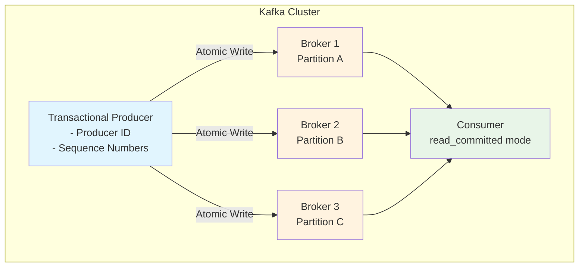
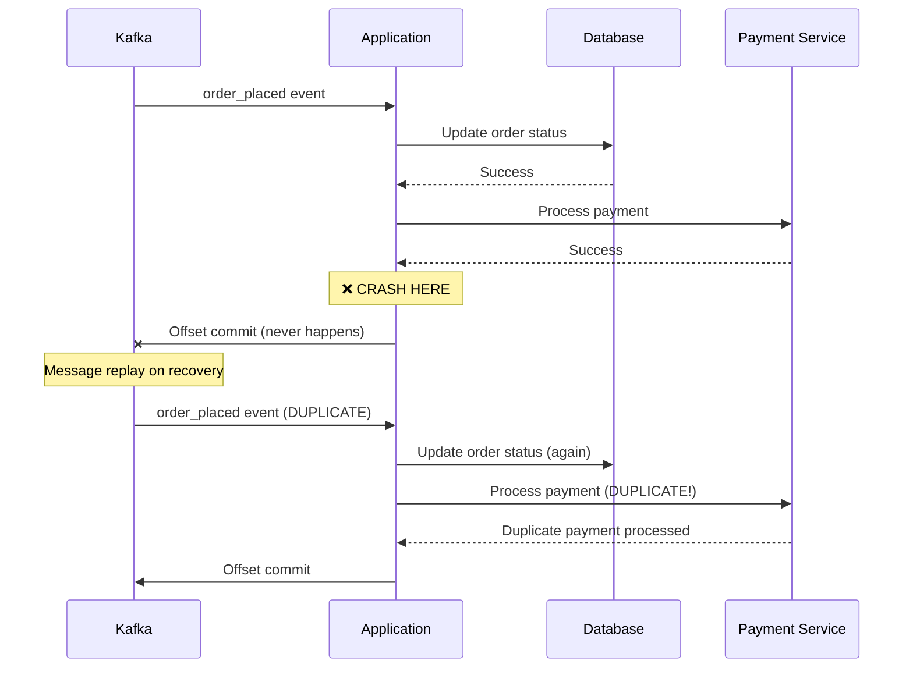
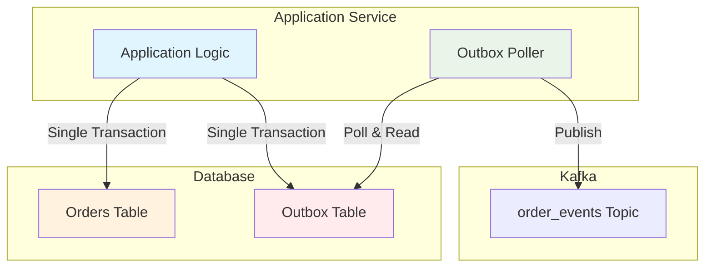
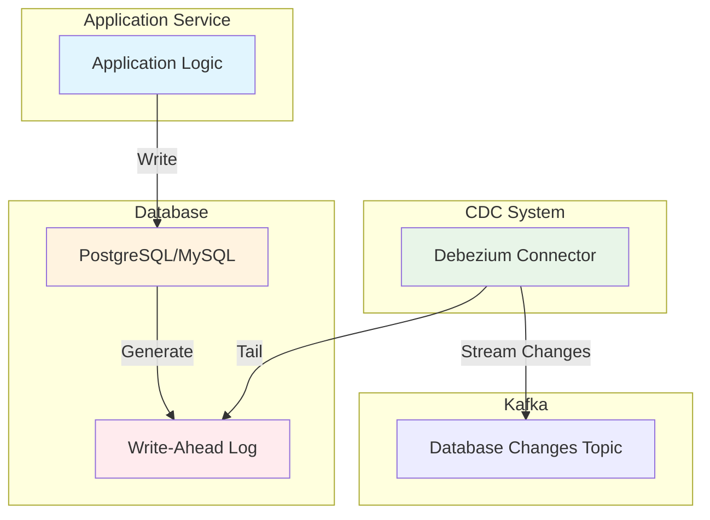
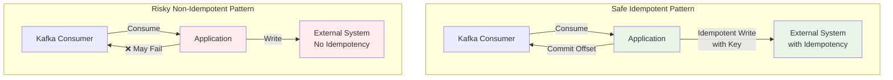
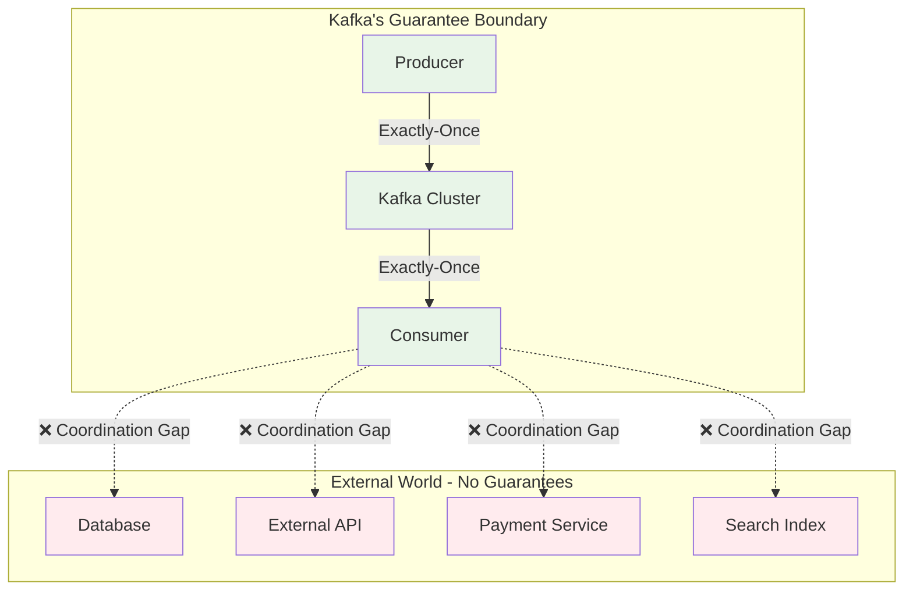

# Exactly-Once Semantics in Kafka — and What Breaks When You Talk to the Outside World

**Author:** Abhijeet  
**Published:** 
**Read Time:** 4 min

Exactly-once delivery sounds like the kind of guarantee you'd expect in any serious data pipeline, but in distributed systems, it is notoriously difficult to achieve. Apache Kafka offers a remarkably robust form of exactly-once semantics — at least within the boundaries of Kafka itself. When you produce a message into Kafka using a transactional producer, the broker ensures that messages appear atomically across multiple partitions and only once to consumers configured in "read_committed" mode. This mechanism is carefully coordinated using producer IDs, sequence numbers, and transactional markers to ensure that retries don't result in duplicate data and that consumers don't see uncommitted intermediate states. But this guarantee has a clear boundary: it stops at Kafka's edge.

## Kafka's Internal Exactly-Once Mechanism

## The Problem: External System Coordination

Once your application consumes a Kafka message and interacts with any external system — be it a database, an external API, a payment service, or even a search index — you are now operating outside Kafka's transactional domain. And this is where many real-world systems run into subtle, sometimes devastating issues. Suppose your consumer reads an order_placed event, processes a payment by updating a database, and finally commits the Kafka offset to indicate the message has been handled. Now, imagine a failure happens between the database write and the offset commit. On recovery, Kafka replays the same message, and your application reprocesses it—resulting in a duplicated payment or some other external side effect. Kafka, having no insight into your database, cannot prevent this. It did its job. The problem lies in coordinating with systems that do not participate in the transaction.

### The Failure Scenario

## Solution Patterns

To bridge this boundary, developers have devised several architectural patterns.

### 1. The Outbox Pattern

The most canonical is the Outbox Pattern, which takes advantage of the transactional guarantees of relational databases. Instead of writing directly to Kafka and your domain tables in two separate steps, your application performs a single database transaction that writes the business change (say, updating the orders table) and simultaneously inserts a pending event into a separate outbox table. A background process—either embedded in the service or decoupled as a poller—then reads this outbox table and publishes the messages to Kafka. Since both the domain write and the event insert occur in the same DB transaction, the system is guaranteed to reflect only committed states to the outside world. The message reaches Kafka only if the database transaction succeeds. This avoids the "write succeeded but event was never published" and the "event published but write didn't happen" scenarios. However, it comes with operational complexity: maintaining an outbox poller, ensuring deduplication in the face of crashes, and dealing with message ordering under parallel execution.

### 2. Change Data Capture (CDC)

An improvement over this manual polling mechanism, especially when using databases like PostgreSQL or MySQL, is to leverage Change Data Capture (CDC) tools like Debezium. With CDC, your application simply writes to the database. Debezium tails the write-ahead log (WAL) and streams changes to Kafka. This removes the need to publish to Kafka directly. Instead, Kafka receives the event through a durable replication-like mechanism, and your services downstream can consume it with the usual guarantees. However, CDC isn't free: it introduces latency, requires careful schema evolution practices, and may leak sensitive internal schema details if not properly designed. Nevertheless, it creates a decoupled, robust model for syncing application state with Kafka.

### 3. Idempotent External Writes

Finally, the simplest but riskiest pattern is to consume from Kafka, perform the external write, and then commit the offset — hoping nothing crashes in between. To make this safe, your write must be idempotent. This could mean using an external idempotency key, inserting with ON CONFLICT DO NOTHING, or ensuring that duplicate writes don't change business outcomes. This strategy is easy to implement but fragile. It requires careful handling of edge cases, retries, partial failures, and observability. It also depends heavily on the external system's behavior: not all systems handle idempotent writes cleanly.

## The Coordination Challenge

## Key Takeaways

The important point is this: Kafka's exactly-once semantics are local. They hold within Kafka's write path and consumer offsets. But once your system interacts with components Kafka can't coordinate with — systems without shared transactions or atomic visibility — you must take responsibility for the coordination. There's no free lunch. The illusion of exactly-once across distributed boundaries is only achievable through patterns that carefully isolate effects, design for retries, and make failure part of the normal path.

If you're building distributed systems, you've likely faced these challenges. Sometimes you realize them too late — when refunds are duplicated, emails are sent twice, or downstream analytics count the same event multiple times. Often, the fix lies not in making the system more clever, but in simplifying the coordination model: contain side effects, structure retries explicitly, and treat delivery and processing as two separate problems.
