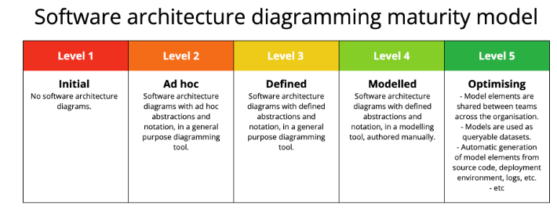

# The “4 + 1” View Model of Software Architecture

## Introduction

The “4 + 1” view model, developed by Philippe Kruchten, is a standard for describing the architecture of software-intensive systems. It provides a structured way to organize the description of a system's architecture into multiple, concurrent views, each addressing a specific set of concerns. This model helps to ensure that all stakeholders, from end-users to developers and project managers, have a clear understanding of the system.

## The Five Views

The model consists of five views: four primary views and one unifying use-case view.

| View Name        | Corresponding UML Diagrams                                                                               |
|:-----------------|:---------------------------------------------------------------------------------------------------------|
| Logical View     | Class Diagram, Object Diagram, Component Diagram, Package Diagram, Composite Structure Diagram             |
| Process View     | Activity Diagram, State Machine Diagram, Sequence Diagram, Timing Diagram, Interaction Overview Diagram    |
| Physical View    | Deployment Diagram                                                                                       |
| Development View | Component Diagram, Package Diagram                                                                       |
| Use Case View    | Use Case Diagram                                                                                         |

## Benefits of the “4 + 1” Views Model

The adoption of the “4 + 1” view model offers several key benefits for software development projects:

- **Clarity:** The model offers a clear and structured way to visualize and communicate different aspects of system architecture.
- **Comprehensiveness:** By breaking down the architecture into five distinct views, it ensures that all essential aspects of the system are considered.
- **Alignment:** The model helps align the technical architecture with user requirements, ensuring that the system meets its intended purpose.
- **Ease of Communication:** Each view is tailored to a specific audience, making it easier to communicate technical details to stakeholders with varying levels of expertise.
- **Efficiency:** The model aids in more efficient development, as it provides a roadmap for both high-level and low-level design and implementation.

## Conclusion

In summary, the “4 + 1” view model is a powerful tool for architectural design and communication, providing a comprehensive framework that enhances clarity, stakeholder alignment, and overall project efficiency.

# C4 model
## Improving diagramming maturity

