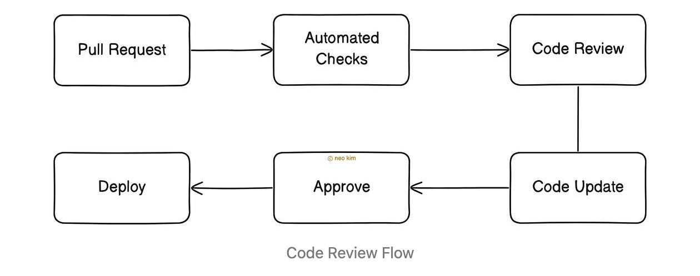
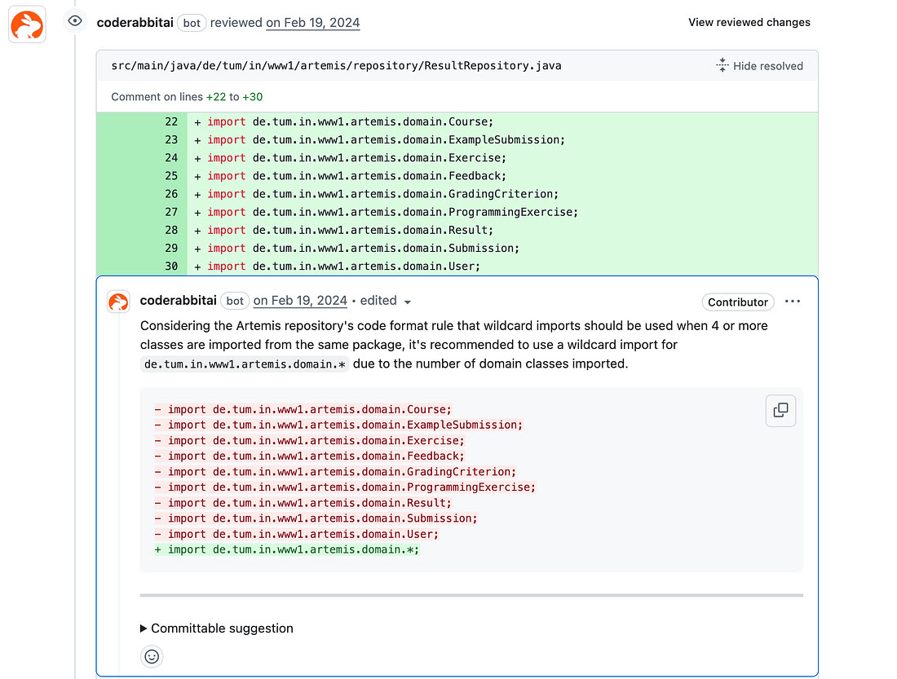
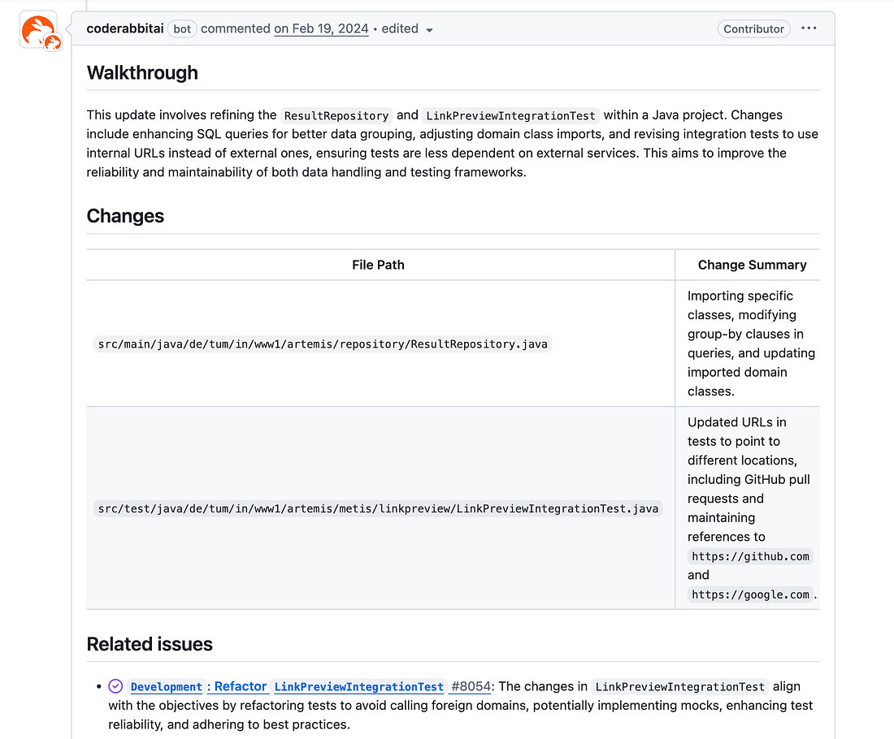

# How to Scale Code Reviews 🔥

A code review is a process where someone other than the author reviews the code. While initially seeming to solve code quality issues, organizations often face new challenges as they scale.

## Common Challenges in Code Reviews:

### 1. Developer Velocity
A strict review process, often focusing on minor issues, can significantly impact developer velocity. This leads to:
* Delayed pull requests.
* Slowed development cycles, especially when low-priority changes are requested on tight deadlines.
* Increased complexity for distributed teams across different time zones.

### 2. Personal Conflict
Without clear guidelines, code reviews can become a battleground for personal preferences, leading to:
* Unnecessary disagreements.
* Demotivated developers.
* Toxic or unprofessional feedback.

### 3. Miscommunication
Remote and asynchronous reviews introduce a risk of misunderstanding feedback. Additionally:
* Reviewers must understand new code and its integration with the existing codebase, potentially leading to overload when balancing reviews with development tasks.
* Even thorough reviews might miss bugs, particularly in large pull requests.

---

# How to Conduct Effective Code Reviews

To mitigate these challenges, here's a structured approach to code reviews:

## 1. Best Practices

Both authors and reviewers must respect each other's time and effort.

### Guidelines for the Code Author:

* **Follow Style Guides:** Adhere to the project's established style guide.
* **Keep Changes Small:** Smaller changes facilitate easier and faster reviews.
* **Self-Review:** Review your own code before requesting others to save time.
* **Use Existing Patterns:** If a style is unspecified, use existing code patterns over personal preferences.
* **Tag Selectively:** Tag only the fewest necessary reviewers.
* **Write Clear Messages:** Provide a clear and concise message about the changes for the reviewer.
* **Use Data for Debates:** Resolve design debates using facts and data, not opinions.
* **Shared Responsibility:** Understand that code reviews are every software engineer's responsibility.

### Guidelines for the Reviewer:

* **Timely Response:** Respond to review requests within 24 hours.
* **Allocate Time:** Reserve at least one calendar slot each day specifically for code reviews.
* **Polite & Constructive Feedback:** Keep reviews polite and constructive, avoiding personal criticism of the author.
* **Document & Checklist:** Document common review points and use a review checklist for consistency.
* **Direct Discussion:** Discuss disagreements directly with the author, then document the solution for future reference.
* **Share Knowledge:** Share relevant documentation in review comments to encourage knowledge sharing.
* **Approve "Good Enough":** Approve pull requests when they are good enough, allowing minor issues to be fixed later.

Remember, code reviews prioritize progress over perfection. The goal is to ensure each change maintains or improves the codebase's health.

## 2. Code Review Flow

Version control platforms like GitHub and GitLab offer pull request features with inline comments, approvals, and automated checks. Specialized peer review software, such as Gerrit, provides even more advanced workflows.

Here’s a typical code review workflow from a developer's perspective:

### 1. Pull Request

* **Branching:** Write code on a separate Git branch to isolate changes.
* **Pre-PR Feedback:** Utilize code editor extensions (e.g., CodeRabbit) for instant feedback and fix suggestions, catching problems before creating a pull request and saving infrastructure resources.
* **Commit & Push:** Commit code with a clear message and push it to the remote repository.
* **Open PR:** Open a pull request from the current branch to the target branch.

### 2. Continuous Integration (CI)

* **Automated Checks:** Run automated checks on the code, including unit tests, static code analysis⁴, security scans, and linting⁵. This ensures code correctness and identifies style issues, code smells, or security vulnerabilities, allowing reviewers to focus on high-level feedback.

* **Automated Issue Detection:** Find issues and get auto-fix suggestions using tools like CodeRabbit to improve developer velocity.

### 3. Code Review

* **Tag Reviewers:** Tag one or more relevant team members to request a review.

* **Code Summary:** Generate a summary of code changes using tools like CodeRabbit. This helps reviewers quickly understand complex changes and assess their impact on the codebase.
* **Feedback:** The reviewer checks the changed files and provides constructive feedback via comments.

### 4. Code Update

* **Address Feedback:** Fix the code based on the reviewer’s comments.
* **Upload & Re-run Checks:** Upload changes to the same pull request and ensure automated checks pass again.
* **Resolve Comments:** Reply to the reviewer's feedback and resolve comments.

### 5. Deploy

* **Approval:** At least one reviewer approves the pull request.
* **Merge & CD Trigger:** Merge the pull request into the target branch, triggering the continuous deployment (CD) pipeline.
* **Staging Deployment:** The CD pipeline builds and deploys the change to the staging environment.
* **Production Release:** Once staging tests pass, the change is released to production.

---

<!-- **References:**
¹ Developer Velocity: [Insert Link/Reference if available]
² Style Guide: [Insert Link/Reference if available]
³ CodeRabbit: [Insert Link/Reference if available]
⁴ Static Code Analysis: [Insert Link/Reference if available]
⁵ Linting: [Insert Link/Reference if available] -->