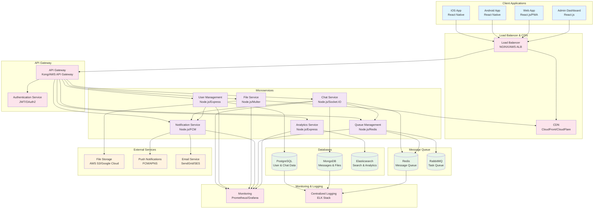
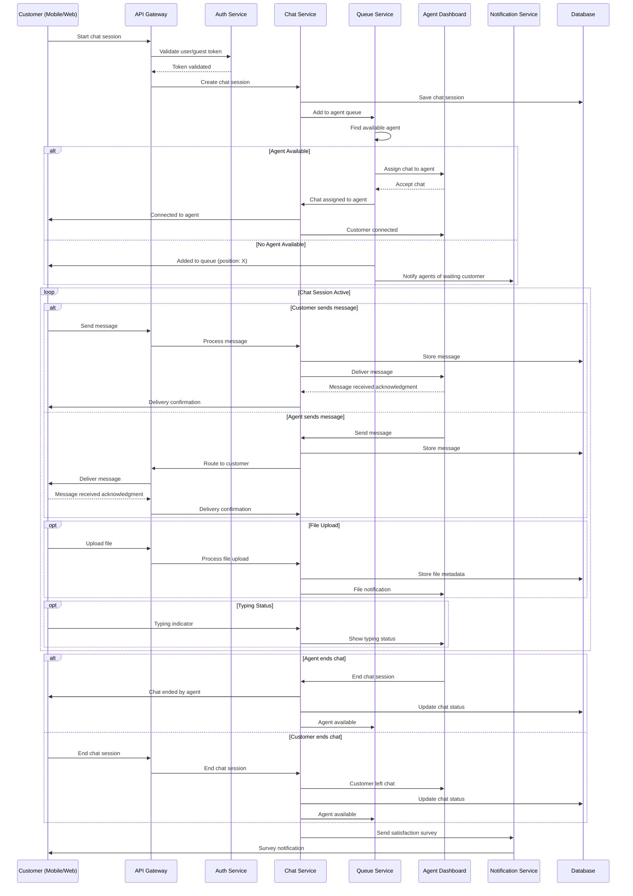
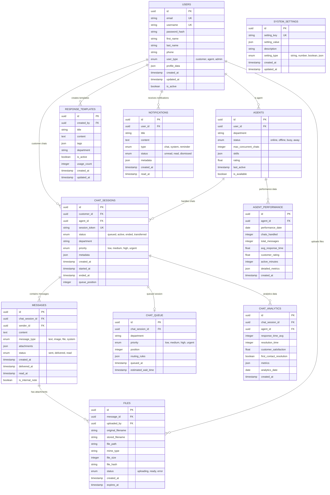

# Chat Support Application Requirements

## 1. Project Overview

A unified chat support system that provides seamless customer service across native mobile applications (iOS/Android) and web applications, with a comprehensive admin dashboard for support agents.

## 2. Functional Requirements

### 2.1 Core Chat Features

- Real-time messaging between customers and support agents
- Message history persistence and retrieval
- File attachment support (images, documents, videos)
- Emoji and reaction support
- Message status indicators (sent, delivered, read)
- Typing indicators
- Online/offline status for agents
- Message search functionality
- Chat session management

### 2.2 User Management

- Customer authentication (guest and registered users)
- Support agent authentication and role management
- User profile management
- Agent availability status management
- Customer identification and history tracking

### 2.3 Queue Management

- Automatic chat routing to available agents
- Queue position indication for customers
- Priority-based routing (VIP customers, urgent issues)
- Load balancing across agents
- Escalation capabilities
- Chat transfer between agents

### 2.4 Multi-Platform Support

- Native iOS application
- Native Android application  
- Web application (responsive design)
- Admin dashboard (web-based)
- API-first architecture for easy integration

### 2.5 Agent Dashboard Features

- Active chat management interface
- Customer information panel
- Chat history and context
- Quick response templates
- Internal notes and tagging
- Performance analytics
- Bulk actions and chat management tools

## 3. Non-Functional Requirements

### 3.1 Performance

- Message delivery latency < 100ms
- Support for 10,000+ concurrent users
- 99.9% uptime availability
- Auto-scaling capabilities
- CDN integration for file sharing

### 3.2 Security

- End-to-end encryption for sensitive data
- Authentication and authorization
- Rate limiting and abuse protection
- Data privacy compliance (GDPR, CCPA)
- Secure file upload and storage

### 3.3 Scalability

- Horizontal scaling support
- Database sharding capabilities
- Microservices architecture
- Load balancer integration
- Caching layer implementation

### 3.4 Integration

- REST API for third-party integrations
- Webhook support for external systems
- CRM system integration capabilities
- Knowledge base integration
- Analytics platform integration

## 4. Technical Requirements

### 4.1 Backend Services

- Real-time communication (WebSocket/Socket.IO)
- RESTful API services
- Message queue system
- File storage and CDN
- Database management (SQL + NoSQL)
- Authentication service
- Notification service

### 4.2 Frontend Applications

- React Native for mobile apps
- React.js for web applications
- Progressive Web App (PWA) capabilities
- Offline mode support
- Push notification integration

### 4.3 Infrastructure

- Cloud-based deployment (AWS/GCP/Azure)
- Container orchestration (Kubernetes)
- Monitoring and logging systems
- Backup and disaster recovery
- CI/CD pipeline integration

## 5. User Stories

### 5.1 Customer Stories

- As a customer, I want to start a chat session quickly without complex registration
- As a customer, I want to receive real-time responses from support agents
- As a customer, I want to upload screenshots to explain my issue better
- As a customer, I want to see my chat history across all platforms
- As a customer, I want to know my position in the queue

### 5.2 Agent Stories

- As an agent, I want to handle multiple chat sessions simultaneously
- As an agent, I want to see customer context and history before responding
- As an agent, I want to use quick response templates for common issues
- As an agent, I want to transfer complex chats to specialized agents
- As an agent, I want to track my performance metrics

### 5.3 Admin Stories

- As an admin, I want to monitor overall system performance and agent productivity
- As an admin, I want to configure chat routing rules and priorities
- As an admin, I want to generate reports on support metrics
- As an admin, I want to manage agent permissions and roles

## 6. Success Metrics

- Average response time < 30 seconds
- Customer satisfaction score > 4.5/5
- First contact resolution rate > 80%
- Agent productivity: 8+ concurrent chats
- System availability > 99.9%
- Mobile app store rating > 4.0/5

## System Architecture

## Flow Diagram

## Database Schema

