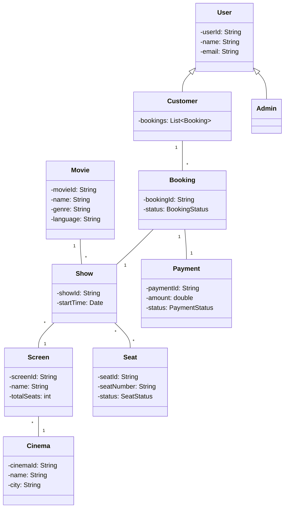

# Movie Ticket Booking System - Low-Level Design

## 1. Requirements Analysis

### Functional Requirements

- Users can search for movies by name, genre, language, and location.
- Users can view available shows for a selected movie in a specific city and cinema.
- Users can select seats and book tickets for a show.
- Users can make payments for bookings.
- Users can cancel bookings and receive refunds as per policy.
- Admins can add, update, or remove movies, cinemas, and shows.
- System should prevent double-booking of seats.

### Non-Functional Requirements

- High availability: System should be available 99.9% of the time.
- Scalability: Should handle high traffic during peak hours (e.g., weekends, holidays).
- Performance: Search and booking operations should complete within 2 seconds.
- Reliability: Ensure data consistency, especially for seat bookings.
- Security: Secure payment processing and user data protection.

### Assumptions & Constraints

- Users must register and log in to book tickets.
- Payment integration with third-party gateways (e.g., Stripe, PayPal).
- Each show has a fixed number of seats.
- Bookings are only allowed for future shows.
- Refunds are processed as per cinema policy.
- System does not handle physical ticket printing.

## 2. High-Level Architecture

### System Components

- **User Service**: Handles user registration, authentication, and profile management.
- **Movie Service**: Manages movie information.
- **Cinema Service**: Manages cinemas and screens.
- **Show Service**: Manages show timings and seat availability.
- **Booking Service**: Handles seat selection, booking, and cancellations.
- **Payment Service**: Integrates with payment gateways.
- **Notification Service**: Sends booking confirmations and reminders.

### Core Entities

- **User**: Represents a customer or admin.
- **Movie**: Contains movie details.
- **Cinema**: Represents a cinema location.
- **Screen**: Represents a screen within a cinema.
- **Show**: Represents a movie show at a specific time and screen.
- **Seat**: Represents a seat in a screen.
- **Booking**: Represents a user's booking for a show.
- **Payment**: Represents payment details for a booking.

### Component Interactions

- Users interact with the system via web/mobile app.
- User Service authenticates users.
- Movie and Cinema Services provide movie and show data.
- Booking Service checks seat availability and creates bookings.
- Payment Service processes payments and updates booking status.
- Notification Service sends emails/SMS after successful booking.

## 3. Class Design

### UML Class Diagram



### Interface Definitions

```java
public interface Search {
    List<Movie> searchMovies(String name, String genre, String language, String city);
}

public interface PaymentGateway {
    boolean processPayment(Payment payment);
    boolean refund(Payment payment);
}
```

### Core Classes

```java
public class User {
    String userId;
    String name;
    String email;
    // ...other fields and methods...
}

public class Customer extends User {
    List<Booking> bookings;
    // ...other fields and methods...
}

public class Admin extends User {
    // ...admin-specific methods...
}

public class Movie {
    String movieId;
    String name;
    String genre;
    String language;
    // ...other fields and methods...
}

public class Cinema {
    String cinemaId;
    String name;
    String city;
    List<Screen> screens;
    // ...other fields and methods...
}

public class Screen {
    String screenId;
    String name;
    int totalSeats;
    List<Seat> seats;
    // ...other fields and methods...
}

public class Show {
    String showId;
    Movie movie;
    Screen screen;
    Date startTime;
    List<Seat> availableSeats;
    // ...other fields and methods...
}

public class Seat {
    String seatId;
    String seatNumber;
    SeatStatus status; // AVAILABLE, BOOKED, BLOCKED
    // ...other fields and methods...
}

public class Booking {
    String bookingId;
    User user;
    Show show;
    List<Seat> seats;
    BookingStatus status; // CONFIRMED, CANCELLED, PENDING
    Payment payment;
    // ...other fields and methods...
}

public class Payment {
    String paymentId;
    double amount;
    PaymentStatus status; // SUCCESS, FAILED, REFUNDED
    // ...other fields and methods...
}
```

## 4. Design Patterns Used

- **Singleton**: For services like PaymentGateway to ensure a single instance.
- **Factory**: For creating different types of notifications (email, SMS).
- **Strategy**: For supporting multiple payment gateways.
- **Observer**: For sending notifications after booking status changes.

## 5. Key Algorithms

- **Seat Locking Algorithm**: Temporarily lock seats when a user selects them to prevent double-booking. Release lock if payment is not completed within a time window (e.g., 5 minutes).
- **Search Optimization**: Use indexing and caching for fast movie/show search.
- **Refund Calculation**: Calculate refund based on cancellation policy (e.g., full refund if cancelled 24 hours before show).

## 6. Exception Handling Strategy

- Use custom exceptions for domain errors (e.g., SeatAlreadyBookedException, PaymentFailedException).
- Log all exceptions for monitoring and debugging.
- Show user-friendly error messages.
- Rollback transactions on failure (e.g., booking or payment failure).

## 7. Thread Safety Considerations

- Use database transactions and row-level locking for seat booking to prevent race conditions.
- Use synchronized blocks or distributed locks if using in-memory seat management.
- Ensure idempotency for payment and booking APIs.

## 8. Testing Strategy

```java
// Example test case: Booking a seat
@Test
public void testBookSeat() {
    // Arrange
    User user = new Customer(...);
    Show show = ...;
    Seat seat = ...;
    // Act
    Booking booking = bookingService.bookSeat(user, show, seat);
    // Assert
    assertEquals(BookingStatus.CONFIRMED, booking.getStatus());
    assertEquals(SeatStatus.BOOKED, seat.getStatus());
}

// Example test case: Double booking prevention
@Test(expected = SeatAlreadyBookedException.class)
public void testDoubleBooking() {
    // Arrange
    // ...
    // Act
    bookingService.bookSeat(user1, show, seat);
    bookingService.bookSeat(user2, show, seat); // Should throw exception
}
```

## 9. Scalability & Extensibility

- Use microservices for each major component (User, Movie, Booking, Payment).
- Use caching for frequently accessed data (e.g., movie listings).
- Use message queues for asynchronous tasks (e.g., notifications).
- Add support for new payment gateways using the Strategy pattern.
- Add new features (e.g., loyalty points, offers) by extending core classes.

## 10. Alternative Approaches

- Use event sourcing for auditability and rollback.
- Use NoSQL databases for flexible schema and high write throughput.
- Use serverless functions for scaling specific operations (e.g., notifications).
