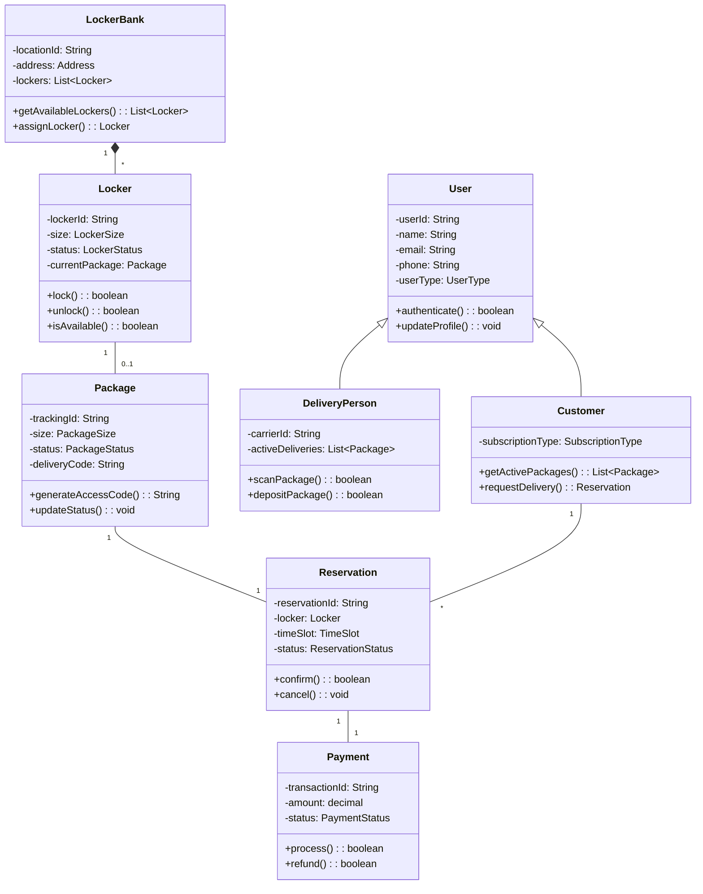

# Shipping Locker System - Low-Level Design

## 1. Requirements Analysis

### Functional Requirements

- User registration and authentication for customers and delivery personnel
- Locker reservation and assignment based on package size and availability
- Package deposit by delivery personnel with secure access codes
- Package pickup by customers using unique access codes
- Real-time notifications via SMS, email, and mobile app
- Payment processing for locker rentals and subscriptions
- Administrative dashboard for system monitoring and management
- Package status tracking and history
- Automated cleanup for abandoned packages
- Support for different package sizes and special handling
- Integration with major shipping carriers' systems
- QR code/barcode scanning for package identification

### Non-Functional Requirements

- High Availability: 99.9% uptime for the system
- Performance:
  - API response time < 500ms
  - Locker door operation < 2 seconds
  - Support 1000+ concurrent users
- Security:
  - End-to-end encryption for all communications
  - Secure access code generation and transmission
  - PCI compliance for payment processing
- Scalability:
  - Support for 10,000+ lockers across multiple locations
  - Horizontal scaling capability for peak loads
- Reliability:
  - Data consistency across distributed systems
  - Fault tolerance for hardware failures
  - Backup power systems for critical operations

### Assumptions & Constraints

- Each locker bank has reliable internet connectivity
- Locker hardware supports remote locking/unlocking
- Maximum package retention time is 72 hours
- Mobile app available for iOS and Android
- Integration with major payment gateways
- Physical constraints:
  - Limited locker sizes available
  - Fixed power supply requirements
  - Temperature control limitations
- Regulatory compliance with local postal laws
- GDPR and data privacy compliance required

## 2. High-Level Architecture

### System Components

1. **Frontend Applications**
   - Customer mobile app (iOS/Android)
   - Delivery personnel app
   - Admin web dashboard
   - Kiosk interface at locker locations

2. **Backend Services**
   - User Management Service
   - Locker Management Service
   - Package Management Service
   - Notification Service
   - Payment Service
   - Analytics Service

3. **Hardware Components**
   - Smart Locker Controller
   - Electronic Lock Mechanism
   - Temperature Sensors
   - Security Cameras
   - Touch Screen Interface

4. **External Integrations**
   - Payment Gateway
   - SMS/Email Service
   - Shipping Carrier APIs
   - Maps/Location Services

### Core Entities

1. **User**
   - Customer
   - Delivery Personnel
   - Admin

2. **Locker**
   - Individual Locker
   - Locker Bank
   - Location

3. **Package**
   - Shipment
   - Tracking
   - Status

4. **Reservation**
   - Booking
   - TimeSlot
   - AccessCode

5. **Payment**
   - Transaction
   - Subscription
   - Invoice

### Component Interactions

1. **User Interactions**
   - Mobile apps communicate with backend via RESTful APIs
   - Real-time updates using WebSocket connections
   - Event-driven architecture for notifications

2. **Hardware Interactions**
   - Locker controllers connect via secure TCP/IP
   - Regular heartbeat signals for status updates
   - Encrypted commands for lock operations

3. **External Service Integration**
   - REST/SOAP APIs for carrier integration
   - Webhook callbacks for payment updates
   - Message queues for asynchronous processing

## 3. Class Design

### UML Class Diagram



### Interface Definitions

```java
public interface UserService {
    User registerUser(UserDTO userDTO);
    boolean authenticateUser(String email, String password);
    User getUserById(String userId);
    void updateUser(UserDTO userDTO);
}

public interface LockerService {
    Locker assignLocker(Package package, Location location);
    boolean unlockLocker(String lockerId, String accessCode);
    List<Locker> getAvailableLockers(Location location, PackageSize size);
    LockerStatus getLockerStatus(String lockerId);
}

public interface PackageService {
    Package createPackage(PackageDTO packageDTO);
    String generateAccessCode(String packageId);
    void updatePackageStatus(String packageId, PackageStatus status);
    Package getPackageById(String packageId);
    List<Package> getPackagesByUser(String userId);
}

public interface PaymentService {
    Payment processPayment(PaymentDTO paymentDTO);
    boolean refundPayment(String transactionId);
    Payment getPaymentStatus(String transactionId);
}

public interface NotificationService {
    void sendSMS(String phoneNumber, String message);
    void sendEmail(String email, String subject, String body);
    void sendPushNotification(String userId, NotificationDTO notification);
}
```

### Core Classes

```java
public class Locker {
    private String lockerId;
    private LockerSize size;
    private LockerStatus status;
    private String currentPackageId;
    private Lock lockMechanism;
    
    public Locker(String lockerId, LockerSize size) {
        this.lockerId = lockerId;
        this.size = size;
        this.status = LockerStatus.AVAILABLE;
        this.lockMechanism = new ElectronicLock();
    }
    
    @Synchronized
    public boolean assignPackage(String packageId) {
        if (status != LockerStatus.AVAILABLE) {
            throw new LockerNotAvailableException();
        }
        this.currentPackageId = packageId;
        this.status = LockerStatus.OCCUPIED;
        return true;
    }
    
    public boolean unlock(String accessCode) {
        if (!validateAccessCode(accessCode)) {
            throw new InvalidAccessCodeException();
        }
        return lockMechanism.unlock();
    }
    
    private boolean validateAccessCode(String accessCode) {
        // Implementation of access code validation
        return true;
    }
}
```

## 4. Design Patterns Used

- **Singleton Pattern**: For system-wide configuration and hardware controller instances
- **Factory Pattern**: Creating different types of lockers and notification handlers
- **Observer Pattern**: For real-time status updates and notifications
- **State Pattern**: Managing locker and package states
- **Strategy Pattern**: Handling different payment methods and notification types
- **Command Pattern**: Encapsulating locker operations (lock/unlock)
- **Repository Pattern**: Data access abstraction for different storage types

## 5. Key Algorithms

1. **Locker Assignment Algorithm**

   ```java
   public Locker assignOptimalLocker(Package package, Location location) {
       // Consider package size, proximity, and availability
       List<Locker> availableLockers = getAvailableLockers(location);
       return availableLockers.stream()
           .filter(l -> l.getSize().fits(package.getSize()))
           .min(Comparator.comparing(l -> l.getDistance(location)))
           .orElseThrow(() -> new NoLockerAvailableException());
   }
   ```

2. **Access Code Generation**

   ```java
   public String generateSecureAccessCode() {
       // Generate unique, secure, time-based access code
       String timeComponent = System.currentTimeMillis();
       String randomComponent = generateRandomString(6);
       return hashWithSalt(timeComponent + randomComponent);
   }
   ```

3. **Package Routing**
   - Based on optimal locker availability
   - Considers package size and user preferences
   - Handles peak load distribution

## 6. Exception Handling Strategy

- Custom exception hierarchy for different error types
- Global exception handling in REST APIs
- Retry mechanism for transient failures
- Circuit breaker for external service calls
- Detailed error logging with correlation IDs
- User-friendly error messages

## 7. Thread Safety Considerations

- Use of synchronized blocks for locker operations
- Optimistic locking for database operations
- Distributed locks for multi-instance deployment
- Thread-safe singleton implementations
- Atomic operations for critical sections
- Connection pooling for database access

## 8. Testing Strategy

```java
// Example test case: Booking a seat
@Test
public void testLockOperation() {
    // Arrange
    Locker locker = new Locker("L123", LockerSize.MEDIUM);
    String validCode = "123456";
    
    // Act
    boolean result = locker.unlock(validCode);
    
    // Assert
    assertTrue(result);
    assertEquals(LockerStatus.UNLOCKED, locker.getStatus());
}

// Example test case: Invalid access code
@Test(expected = InvalidAccessCodeException.class)
public void testInvalidAccessCode() {
    Locker locker = new Locker("L123", LockerSize.MEDIUM);
    locker.unlock("invalid_code"); // Should throw exception
}
```

## 9. Scalability & Extensibility

- Microservices architecture for independent scaling
- Redis caching for frequently accessed data
- Database sharding by location
- Event-driven architecture for decoupling
- API versioning for backward compatibility
- Pluggable modules for new features

## 10. Alternative Approaches

1. **Architecture Alternatives**
   - Monolithic vs. Microservices
   - Serverless architecture for certain components
   - Edge computing for locker controllers

2. **Database Choices**
   - NoSQL for flexibility
   - Time-series DB for monitoring
   - Graph DB for location optimization

3. **Communication Patterns**
   - REST vs. gRPC
   - Message Queue vs. Direct Communication
   - WebSocket vs. Long Polling
